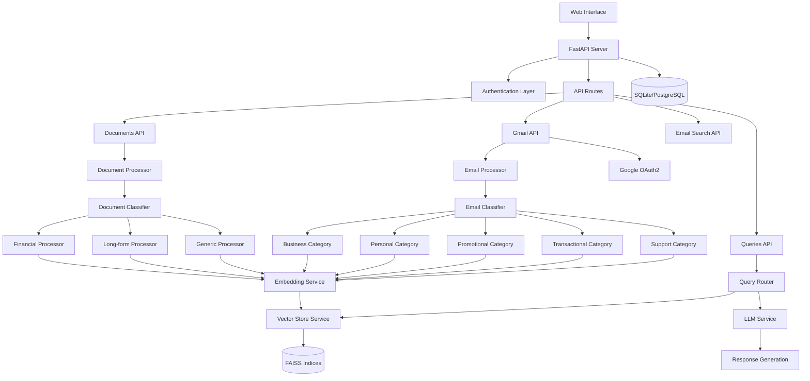
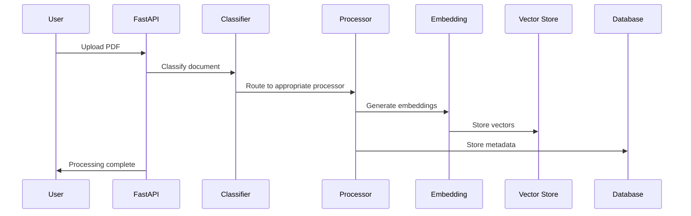
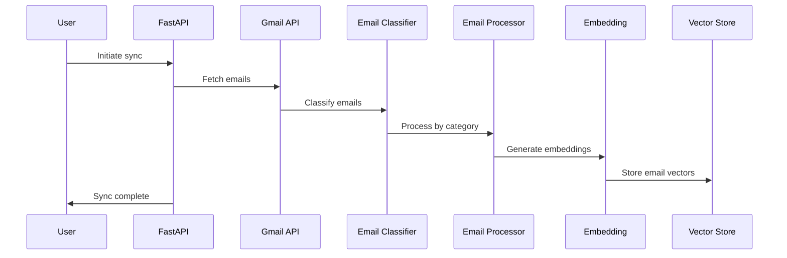
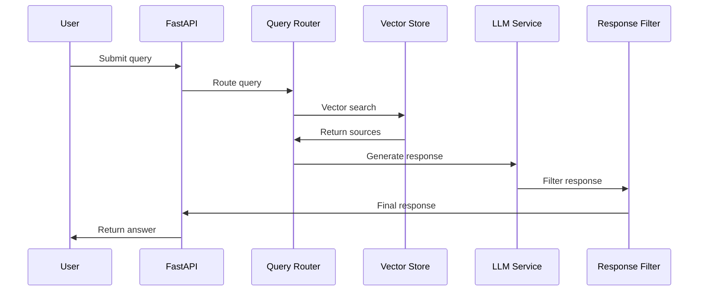

# Architecture Overview

Personal AI Agent is built with a modern, modular architecture designed for scalability, maintainability, and privacy.

## System Architecture



## Core Components

### 1. FastAPI Application Layer

**Location**: `app/main.py`

The main application entry point with:
- Modern lifespan management
- CORS configuration
- Static file serving
- Exception handling
- Health check endpoints

**Key Features**:
- Async/await support for high performance
- Automatic API documentation generation
- Request/response validation
- Middleware for logging and security

### 2. Authentication System

**Location**: `app/api/endpoints/auth.py`, `app/core/security.py`

JWT-based authentication with:
- User registration and login
- Password hashing with bcrypt
- Token generation and validation
- User session management

**Security Features**:
- Configurable token expiration
- Secure password storage
- CSRF protection
- Rate limiting (planned)

### 3. Document Processing Pipeline

**Location**: `app/utils/processors/`

Multi-stage document processing:

#### Document Classification (`app/utils/document_classifier.py`)
Automatically categorizes documents:
- **Financial**: Bank statements, invoices (transaction patterns, dollar amounts)
- **Long-form**: Research papers, reports (50+ pages, academic structure)
- **Generic**: Resumes, letters (default classification)

#### Category-Specific Processors
- **Financial Processor**: Small chunks (500 chars) for precise transaction matching
- **PDF Processor**: Large chunks (1500 chars) for comprehensive context
- **Base Processor**: Balanced approach (1000 chars) for general documents

### 4. Gmail Integration System

**Location**: `app/services/email/`, `app/api/endpoints/gmail.py`

Complete email processing pipeline:

#### OAuth2 Authentication
- Google Cloud Console integration
- Secure token management
- Refresh token handling
- Permission scoping

#### Email Classification (`app/services/email/email_classifier.py`)
Categorizes emails into:
- **Business**: Meeting invites, project updates
- **Personal**: Family, friends communications
- **Promotional**: Marketing, newsletters
- **Transactional**: Receipts, confirmations
- **Support**: Customer service interactions

#### Thread Processing
- Conversation context preservation
- Chronological message ordering
- Thread-aware chunking
- Attachment text extraction

### 5. Vector Storage System

**Location**: `app/services/vector_store_service.py`

Organized vector database architecture:

#### Storage Structure
```
data/vector_db/
├── financial/
│   ├── user_{id}_doc_{filename}.index
│   └── user_{id}_doc_{filename}.pkl
├── long_form/
├── generic/
└── emails/
    ├── user_{id}_email_{source}_{id}.index
    └── user_{id}_email_{source}_{id}.pkl
```

#### FAISS Integration
- Category-specific indices
- User isolation
- Optimized search performance
- Scalable storage

### 6. Query Processing Engine

**Location**: `app/services/query_router.py`, `app/utils/llm.py`

Intelligent query routing and processing:

#### Query Router
- Content type determination (PDF, email, both)
- Category-aware search routing
- Context assembly from multiple sources
- Cross-content ranking

#### LLM Integration
- Mistral 7B local model
- Metal acceleration (macOS)
- Context-aware response generation
- Source attribution and citation

### 7. Embedding Service

**Location**: `app/services/embedding_service.py`

Vector embedding generation:
- Sentence Transformers (MiniLM-L6-v2)
- Batch processing optimization
- Normalized embeddings
- Consistent vector dimensions

## Data Flow Architecture

### 1. Document Upload Flow



### 2. Gmail Sync Flow



### 3. Query Processing Flow



## Database Schema

### Core Tables

#### Users
```sql
CREATE TABLE users (
    id INTEGER PRIMARY KEY,
    username VARCHAR(50) UNIQUE,
    email VARCHAR(100) UNIQUE,
    hashed_password VARCHAR(100),
    is_active BOOLEAN,
    created_at TIMESTAMP
);
```

#### Documents
```sql
CREATE TABLE documents (
    id INTEGER PRIMARY KEY,
    user_id INTEGER REFERENCES users(id),
    filename VARCHAR(255),
    original_filename VARCHAR(255),
    file_path VARCHAR(500),
    file_size INTEGER,
    document_type VARCHAR(50),
    processing_status VARCHAR(50),
    created_at TIMESTAMP,
    processed_at TIMESTAMP
);
```

#### Document Chunks
```sql
CREATE TABLE document_chunks (
    id INTEGER PRIMARY KEY,
    document_id INTEGER REFERENCES documents(id),
    chunk_index INTEGER,
    content TEXT,
    chunk_size INTEGER,
    metadata JSONB
);
```

#### Email Messages
```sql
CREATE TABLE email_messages (
    id INTEGER PRIMARY KEY,
    user_id INTEGER REFERENCES users(id),
    gmail_id VARCHAR(100),
    thread_id VARCHAR(100),
    subject TEXT,
    sender VARCHAR(255),
    date TIMESTAMP,
    category VARCHAR(50),
    processed_at TIMESTAMP
);
```

#### Queries
```sql
CREATE TABLE queries (
    id INTEGER PRIMARY KEY,
    user_id INTEGER REFERENCES users(id),
    query_text TEXT,
    response TEXT,
    query_type VARCHAR(50),
    processing_time FLOAT,
    created_at TIMESTAMP
);
```

## Configuration Architecture

### Environment-Based Configuration

**Location**: `app/core/config.py`

Hierarchical configuration system:
1. Default values
2. Environment variables
3. Configuration files
4. Runtime overrides

### Configuration Categories

#### Server Configuration
- Host, port, debug mode
- CORS settings
- Static file paths

#### Security Configuration
- JWT secret keys
- Token expiration
- Password hashing parameters

#### LLM Configuration
- Model paths and parameters
- Hardware acceleration settings
- Context window sizes

#### Database Configuration
- Connection strings
- Pool settings
- Migration parameters

#### Gmail Integration
- OAuth2 credentials
- API quotas and limits
- Sync parameters

## Security Architecture

### Authentication Security
- JWT token-based authentication
- Bcrypt password hashing
- Configurable token expiration
- CSRF protection

### Data Security
- User data isolation
- Encrypted token storage
- Local processing (no external API calls)
- Configurable data retention

### API Security
- Request validation
- Rate limiting (planned)
- Input sanitization
- Error message sanitization

### Gmail Security
- OAuth2 flow with minimal permissions
- Secure token refresh
- Revocable access tokens
- Audit logging

## Performance Architecture

### Caching Strategy
- Vector embedding caching
- Query result caching
- Model loading optimization
- Database connection pooling

### Optimization Techniques
- Async/await throughout
- Batch processing for embeddings
- Category-specific search optimization
- Hardware acceleration (Metal/CUDA)

### Scalability Considerations
- User data isolation
- Horizontal scaling support
- Database optimization
- Vector store partitioning

## Development Architecture

### Modular Design
- Clear separation of concerns
- Dependency injection
- Interface-based design
- Testable components

### Code Organization
```
app/
├── api/           # API endpoints
├── core/          # Core configuration
├── db/            # Database models
├── services/      # Business logic
├── utils/         # Utilities
└── schemas/       # Pydantic models
```

### Testing Strategy
- Unit tests for components
- Integration tests for workflows
- API endpoint testing
- Performance testing

## Future Architecture Considerations

### Planned Enhancements
- Notion integration
- Advanced analytics
- Multi-tenant support
- Cloud deployment options

### Scalability Roadmap
- Microservices architecture
- Container orchestration
- Distributed vector storage
- Advanced caching layers