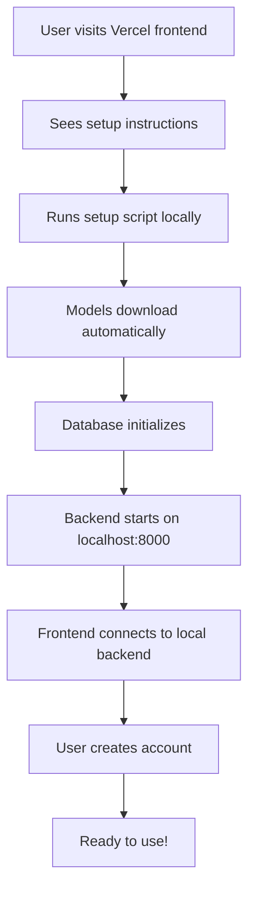
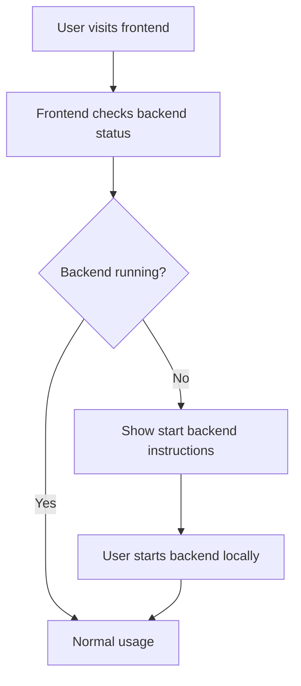

# Hybrid Deployment Architecture

A privacy-first deployment strategy where the frontend is hosted on Vercel for accessibility while the backend runs locally to keep your data private.

## 🎯 Architecture Overview

```
┌─────────────────┐    HTTPS    ┌─────────────────┐
│   Vercel v0     │────────────▶│   Local User    │
│   Frontend      │             │   Machine       │
│ (Public Access) │             │                 │
└─────────────────┘             │ ┌─────────────┐ │
                                │ │   Backend   │ │
                                │ │  (Private)  │ │
                                │ └─────────────┘ │
                                │ ┌─────────────┐ │
                                │ │ Vector DB   │ │
                                │ │  (Local)    │ │
                                │ └─────────────┘ │
                                │ ┌─────────────┐ │
                                │ │ LLM Models  │ │
                                │ │  (Local)    │ │
                                │ └─────────────┘ │
                                └─────────────────┘
```

## ✨ Benefits

- **🔒 Privacy First**: All AI processing and data storage remains local
- **🌍 Global Access**: Frontend deployed on Vercel CDN for fast worldwide access
- **💰 Cost Effective**: No cloud AI API costs (GPT-4, Claude, etc.)
- **🚀 Easy Setup**: Automated local backend installation
- **🔧 Flexible**: Users can run backend anywhere (localhost, home server, cloud)

## 📋 Prerequisites

- **Node.js 18+** (for frontend development)
- **Python 3.8+** (for backend)
- **Git** (for repository cloning)
- **4GB+ RAM** (for local LLM models)

## 🚀 Quick Start Guide

### Step 1: Deploy Frontend to Vercel

#### Option A: Deploy from GitHub (Recommended)
1. Fork the frontend repository: `https://github.com/your-username/PersonalAIAgent-Frontend`
2. Connect to Vercel and deploy
3. Set environment variable in Vercel:
   ```
   NEXT_PUBLIC_API_URL = http://localhost:8000
   ```

#### Option B: Manual Deployment
```bash
# Clone frontend repository
git clone https://github.com/your-username/PersonalAIAgent-Frontend
cd PersonalAIAgent-Frontend

# Install dependencies
npm install

# Build for production
npm run build

# Deploy to Vercel
npx vercel --prod
```

### Step 2: Local Backend Setup (Automated)

Create an automated setup script that users can run:

```bash
# Download and run the setup script
curl -fsSL https://raw.githubusercontent.com/your-username/PersonalAIAgent/main/scripts/setup.sh | bash
```

**Or manual setup:**

```bash
# Clone the backend repository
git clone https://github.com/your-username/PersonalAIAgent
cd PersonalAIAgent

# Run the automated setup
chmod +x scripts/setup.sh
./scripts/setup.sh
```

## 🛠️ Automated Setup Script

Create `scripts/setup.sh` for one-command installation:

```bash
#!/bin/bash

# Personal AI Agent - Local Backend Setup Script
set -e

echo "🚀 Personal AI Agent - Local Backend Setup"
echo "=========================================="

# Check prerequisites
check_prerequisites() {
    echo "📋 Checking prerequisites..."
    
    # Check Python
    if ! command -v python3 &> /dev/null; then
        echo "❌ Python 3.8+ is required. Please install Python first."
        exit 1
    fi
    
    # Check Python version
    python_version=$(python3 -c 'import sys; print(".".join(map(str, sys.version_info[:2])))')
    if [ "$(printf '%s\n' "3.8" "$python_version" | sort -V | head -n1)" != "3.8" ]; then
        echo "❌ Python 3.8+ required. Current version: $python_version"
        exit 1
    fi
    
    echo "✅ Python $python_version found"
}

# Create virtual environment
setup_environment() {
    echo "🔧 Setting up virtual environment..."
    python3 -m venv .venv
    source .venv/bin/activate
    echo "✅ Virtual environment created"
}

# Install dependencies
install_dependencies() {
    echo "📦 Installing dependencies..."
    pip install --upgrade pip
    pip install -r requirements.txt
    echo "✅ Dependencies installed"
}

# Download models
download_models() {
    echo "🤖 Downloading AI models..."
    echo "This may take a few minutes depending on your internet connection..."
    
    # Download LLM model
    python download_model.py
    echo "✅ LLM model downloaded"
    
    # Download embedding model
    python download_embedding_model.py
    echo "✅ Embedding model downloaded"
}

# Setup database
setup_database() {
    echo "🗄️ Setting up database..."
    python setup_db.py
    echo "✅ Database initialized"
}

# Setup environment file
setup_env_file() {
    echo "⚙️ Setting up environment configuration..."
    
    if [ ! -f .env ]; then
        cp .env.example .env
        echo "✅ Environment file created from template"
        echo "📝 Please edit .env file to configure Gmail OAuth (optional)"
    else
        echo "✅ Environment file already exists"
    fi
}

# Create admin user
create_admin() {
    echo "👤 Creating admin user..."
    echo "You'll be prompted to create an admin account"
    python create_admin.py
}

# Main installation process
main() {
    check_prerequisites
    setup_environment
    install_dependencies
    download_models
    setup_database
    setup_env_file
    
    echo ""
    echo "🎉 Installation completed successfully!"
    echo ""
    echo "📝 Next steps:"
    echo "1. Edit .env file for Gmail integration (optional)"
    echo "2. Run: source .venv/bin/activate"
    echo "3. Run: python create_admin.py (to create your user account)"
    echo "4. Run: python main.py (to start the backend)"
    echo ""
    echo "🌐 Your backend will be available at: http://localhost:8000"
    echo "🖥️ Access your frontend at: https://your-app.vercel.app"
    echo ""
    echo "For troubleshooting, see: https://github.com/your-username/PersonalAIAgent/blob/main/TROUBLESHOOTING.md"
}

# Run main function
main "$@"
```

## 🔧 Frontend Configuration

### API Client Setup

The frontend needs to communicate with the local backend. Update your v0 frontend:

```typescript
// lib/api-config.ts
export const API_CONFIG = {
  // Default to localhost for development
  baseURL: process.env.NEXT_PUBLIC_API_URL || 'http://localhost:8000',
  
  // Connection settings
  timeout: 30000, // 30 seconds
  retries: 3,
  
  // CORS settings
  credentials: 'include',
  
  // Headers
  headers: {
    'Content-Type': 'application/json',
  }
};

// Check if backend is accessible
export async function checkBackendHealth(): Promise<boolean> {
  try {
    const response = await fetch(`${API_CONFIG.baseURL}/api/health-check`, {
      method: 'GET',
      timeout: 5000
    });
    return response.ok;
  } catch {
    return false;
  }
}
```

### Connection Status Component

```typescript
// components/connection-status.tsx
'use client';

import { useState, useEffect } from 'react';
import { checkBackendHealth } from '@/lib/api-config';

export function ConnectionStatus() {
  const [isConnected, setIsConnected] = useState<boolean | null>(null);

  useEffect(() => {
    const checkConnection = async () => {
      const connected = await checkBackendHealth();
      setIsConnected(connected);
    };

    checkConnection();
    const interval = setInterval(checkConnection, 30000); // Check every 30s

    return () => clearInterval(interval);
  }, []);

  if (isConnected === null) {
    return (
      <div className="flex items-center gap-2 text-yellow-600">
        <div className="w-2 h-2 bg-yellow-500 rounded-full animate-pulse" />
        Checking connection...
      </div>
    );
  }

  return (
    <div className={`flex items-center gap-2 ${isConnected ? 'text-green-600' : 'text-red-600'}`}>
      <div className={`w-2 h-2 rounded-full ${isConnected ? 'bg-green-500' : 'bg-red-500'}`} />
      {isConnected ? 'Backend Connected' : 'Backend Disconnected'}
    </div>
  );
}
```

## 🔒 Security Configuration

### CORS Setup

Update `app/core/config.py`:

```python
class Settings:
    # CORS settings for hybrid deployment
    ALLOWED_ORIGINS: list = [
        "https://your-vercel-app.vercel.app",  # Production frontend
        "http://localhost:3000",               # Local frontend dev
        "http://127.0.0.1:3000",              # Alternative localhost
    ]
    
    # Only allow credentials from trusted origins
    CORS_ALLOW_CREDENTIALS: bool = True
    
    # Restrict methods and headers in production
    CORS_ALLOW_METHODS: list = ["GET", "POST", "PUT", "DELETE", "OPTIONS"]
    CORS_ALLOW_HEADERS: list = ["*"]
```

### Environment Variables

User's `.env` file should include:

```env
# Server Configuration
HOST=localhost  # Keep localhost for privacy
PORT=8000
DEBUG=false

# CORS Configuration  
ALLOWED_ORIGINS=https://your-vercel-app.vercel.app,http://localhost:3000

# Security
SECRET_KEY=your-generated-secret-key
ACCESS_TOKEN_EXPIRE_MINUTES=1440  # 24 hours for better UX

# Database (Local)
DATABASE_URL=sqlite:///./personal_ai_agent.db

# LLM Configuration (Local models)
LLM_MODEL_PATH=./models/mistral-7b-instruct-v0.1.Q4_K_M.gguf
USE_METAL=true  # macOS GPU acceleration
METAL_N_GPU_LAYERS=1

# Gmail Integration (Optional)
GMAIL_CLIENT_ID=your-client-id
GMAIL_CLIENT_SECRET=your-client-secret
GMAIL_REDIRECT_URI=http://localhost:8000/api/gmail/callback
```

## 📱 User Experience Flow

### 1. Initial Setup


### 2. Daily Usage


## 🚀 Advanced Deployment Options

### Option 1: Docker Container (Advanced Users)

Create `Dockerfile`:

```dockerfile
FROM python:3.11-slim

WORKDIR /app
COPY requirements.txt .
RUN pip install -r requirements.txt

COPY . .
RUN python download_model.py
RUN python download_embedding_model.py

EXPOSE 8000
CMD ["python", "main.py"]
```

Docker setup script:

```bash
# Build and run with Docker
docker build -t personal-ai-agent .
docker run -p 8000:8000 -v $(pwd)/data:/app/data personal-ai-agent
```

### Option 2: Home Server Deployment

For users with always-on hardware:

```bash
# Install as system service (Linux)
sudo cp scripts/personal-ai-agent.service /etc/systemd/system/
sudo systemctl enable personal-ai-agent
sudo systemctl start personal-ai-agent
```

### Option 3: Cloud Deployment (Privacy Trade-off)

For users who want cloud deployment:

```yaml
# docker-compose.yml for cloud deployment
version: '3.8'
services:
  backend:
    build: .
    ports:
      - "8000:8000"
    environment:
      - HOST=0.0.0.0
      - ALLOWED_ORIGINS=https://your-vercel-app.vercel.app
    volumes:
      - ./data:/app/data
```

## 📊 Monitoring and Maintenance

### Health Check Endpoint

The backend provides monitoring at `/api/health-check`:

```json
{
  "status": "ok",
  "version": "1.0.0",
  "uptime": "2h 30m",
  "models_loaded": true,
  "database_connected": true,
  "vector_store_ready": true
}
```

### Automatic Updates

Create `scripts/update.sh`:

```bash
#!/bin/bash
echo "🔄 Updating Personal AI Agent..."

# Pull latest changes
git pull origin main

# Update dependencies
source .venv/bin/activate
pip install -r requirements.txt

# Run migrations if needed
python migrate_db.py

echo "✅ Update completed!"
```

## 🛠️ Troubleshooting

### Common Issues

1. **Backend not accessible from frontend**
   - Check CORS configuration
   - Verify backend is running on correct port
   - Check firewall settings

2. **Models not downloading**
   - Check internet connection
   - Verify sufficient disk space (models ~4GB)
   - Check download script permissions

3. **Database connection issues**
   - Verify SQLite file permissions
   - Check database initialization
   - Run `python setup_db.py` again

4. **Gmail OAuth not working**
   - Verify Google Cloud Console setup
   - Check redirect URI configuration
   - Validate client ID/secret in .env

### Debugging Commands

```bash
# Check backend status
curl http://localhost:8000/api/health-check

# Test database connection
python -c "from app.db.database import get_db; print('DB OK')"

# Verify models are loaded
python test_model_loading.py

# Check logs
tail -f logs/app.log
```

## 📚 Documentation Links

- **Setup Guide**: `/docs/setup.md`
- **API Reference**: `/docs/api/`
- **Troubleshooting**: `/docs/troubleshooting.md`
- **Security Guide**: `/docs/security.md`
- **Frontend Integration**: `/docs/frontend-integration.md`

## 🤝 Support and Community

- **GitHub Issues**: Report bugs and feature requests
- **Discussions**: Community support and questions  
- **Wiki**: Detailed documentation and guides
- **Discord**: Real-time community support (optional)

## 🔄 Migration from Current Setup

If you already have the system running:

1. **Backup your data**:
   ```bash
   cp -r data/ data_backup/
   cp .env .env.backup
   ```

2. **Deploy frontend to Vercel** (one-time)

3. **Update CORS settings** in your local backend

4. **Test the hybrid setup**

5. **Update frontend URL** in your bookmarks

No data migration needed - your local backend continues running as-is!

## 📈 Future Enhancements

### Planned Features

1. **Mobile App**: React Native app connecting to local backend
2. **Desktop App**: Electron wrapper for offline-first experience  
3. **Browser Extension**: Quick access to AI assistant
4. **API Gateway**: Optional cloud proxy for remote access
5. **Backup Sync**: Encrypted cloud backup of local data
6. **Multi-User**: Family/team accounts on single backend
7. **Plugin System**: Third-party integrations and extensions

### Community Contributions

- **Frontend Themes**: Dark/light mode, custom themes
- **Language Packs**: Multi-language support
- **Model Options**: Support for different LLM models
- **Integrations**: Notion, Obsidian, Roam Research
- **Mobile Apps**: iOS/Android native apps

This hybrid architecture provides the perfect balance of accessibility and privacy, allowing users to enjoy a modern web interface while keeping their sensitive data completely local and private.