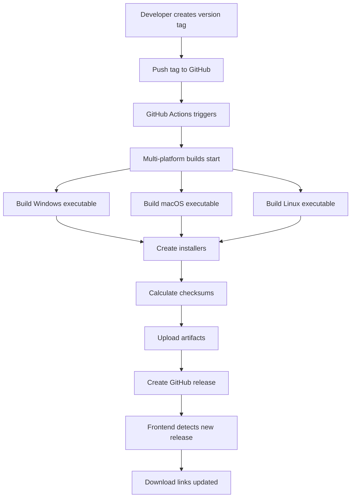

# Build Version Management Guide

This document provides comprehensive guidance on version management, release triggers, and build commands for the Personal AI Agent project.

## Table of Contents

1. [Version Strategy](#version-strategy)
2. [Version Trigger Commands](#version-trigger-commands)
3. [Release Workflow](#release-workflow)
4. [Build Variants](#build-variants)
5. [Version History](#version-history)
6. [Hotfix Process](#hotfix-process)
7. [Pre-release Management](#pre-release-management)
8. [Local Build Commands](#local-build-commands)

## Version Strategy

The Personal AI Agent follows **Semantic Versioning (SemVer)** with the format: `MAJOR.MINOR.PATCH`

### Version Format
```
v{MAJOR}.{MINOR}.{PATCH}[-{PRERELEASE}][+{BUILD}]
```

### Version Components

- **MAJOR** (`v2.0.0`): Breaking changes, incompatible API changes
- **MINOR** (`v1.1.0`): New features, backwards-compatible functionality
- **PATCH** (`v1.0.1`): Bug fixes, backwards-compatible fixes
- **PRERELEASE** (`v1.1.0-beta.1`): Alpha, beta, release candidate versions
- **BUILD** (`v1.0.0+20250121`): Build metadata (optional)

### Version Examples

```bash
v1.0.0          # Initial stable release
v1.0.1          # Bug fix release  
v1.1.0          # Minor feature release
v2.0.0          # Major version with breaking changes
v1.1.0-beta.1   # Beta prerelease
v1.1.0-rc.1     # Release candidate
v1.0.0+build.1  # Build metadata
```

## Version Trigger Commands

### Creating a New Release

#### Standard Release Process
```bash
# 1. Ensure you're on the main/feature branch
git checkout feature/desktop-installer

# 2. Create and push the version tag
git tag -a v1.0.1 -m "Release v1.0.1: Bug fixes and improvements

## Changes
- Fixed GitHub download URL issues
- Enhanced error handling in backend installer
- Updated documentation

## Assets
- Windows executable (~100MB)
- macOS executable (~100MB)  
- Linux executable (~100MB)
"

# 3. Push the tag to trigger CI/CD
git push origin v1.0.1
```

#### Quick Release (Minimal Message)
```bash
# Create tag with short message
git tag -a v1.0.1 -m "v1.0.1: Bug fixes"
git push origin v1.0.1
```

#### Lightweight Tag (Not Recommended)
```bash
# Creates tag without annotation (less info)
git tag v1.0.1
git push origin v1.0.1
```

### Version Increment Commands

#### Patch Release (Bug Fixes)
```bash
# Current: v1.0.0 → Next: v1.0.1
git tag -a v1.0.1 -m "v1.0.1: Critical bug fixes

- Fixed Gmail sync error handling
- Resolved backend installer download issues
- Updated error messages for better UX
"
git push origin v1.0.1
```

#### Minor Release (New Features)
```bash
# Current: v1.0.1 → Next: v1.1.0  
git tag -a v1.1.0 -m "v1.1.0: New features and enhancements

## New Features
- Added dark mode support
- Enhanced document classification
- Improved email threading

## Improvements  
- Better performance for large documents
- Enhanced UI responsiveness
- Reduced memory usage
"
git push origin v1.1.0
```

#### Major Release (Breaking Changes)
```bash
# Current: v1.1.0 → Next: v2.0.0
git tag -a v2.0.0 -m "v2.0.0: Major release with breaking changes

## Breaking Changes
- New database schema (migration required)
- Updated API endpoints
- Changed configuration format

## New Features
- Multi-user support
- Enhanced security
- Performance improvements

## Migration Guide
See MIGRATION_GUIDE.md for upgrade instructions.
"
git push origin v2.0.0
```

### Advanced Version Commands

#### List All Tags
```bash
# Show all version tags
git tag -l

# Show tags with pattern
git tag -l "v1.*"

# Show tags with commit info
git tag -l --format="%(refname:short) %(subject)"
```

#### Delete Tags
```bash
# Delete local tag
git tag -d v1.0.1

# Delete remote tag  
git push origin --delete v1.0.1

# Delete both local and remote
git tag -d v1.0.1 && git push origin --delete v1.0.1
```

#### Verify Tags
```bash
# Show tag details
git show v1.0.1

# Verify tag signature (if signed)
git tag -v v1.0.1

# Show commit for tag
git rev-list -n 1 v1.0.1
```

## Release Workflow

### Automatic Release Workflow



### Manual Release Workflow

1. **Navigate to Actions Tab**
   ```
   https://github.com/gitKnowsMe/personal_ai_agent/actions
   ```

2. **Select Build Workflow**
   - Click "Build Personal AI Agent Executables"
   - Click "Run workflow"

3. **Configure Parameters**
   ```yaml
   Version: v1.0.2
   Include Models: false  # or true for full builds
   Draft Release: true    # or false for immediate publication
   ```

4. **Monitor Build Progress**
   - Watch multi-platform builds
   - Check for any failures
   - Review generated artifacts

5. **Publish Release**
   - Review draft release
   - Edit release notes if needed
   - Click "Publish release"

## Build Variants

### Standard Build (Recommended)
```bash
# Creates ~100MB executables (models downloaded separately)
git tag -a v1.0.0 -m "v1.0.0: Standard release"
git push origin v1.0.0
```

**Includes:**
- Application executable
- Installation scripts  
- Model downloader
- Documentation

**User Experience:**
1. Download executable (~100MB)
2. Run installer
3. Download models (~4GB)
4. Start application

### Full Build (Manual Dispatch Only)
```yaml
# Via GitHub Actions manual dispatch
Version: v1.0.0-full
Include Models: true
Draft Release: false
```

**Includes:**
- Application executable
- All AI models embedded
- Installation scripts
- Documentation

**User Experience:**
1. Download executable (~4GB)
2. Run installer  
3. Start application immediately

### Development Build
```bash
# Pre-release version for testing
git tag -a v1.1.0-beta.1 -m "v1.1.0-beta.1: Development preview

## Preview Features
- New document processor
- Enhanced email classification
- UI improvements

## Known Issues
- Performance optimization pending
- Some features may be unstable

## For Testing Only
Not recommended for production use.
"
git push origin v1.1.0-beta.1
```

## Version History

### Current Releases

| Version | Date | Type | Description |
|---------|------|------|-------------|
| v1.0.0 | 2025-01-21 | Major | Initial desktop installer release |
| v1.0-pre-monorepo | - | Legacy | Pre-monorepo structure |

### Planned Releases

| Version | Target | Type | Features |
|---------|--------|------|----------|
| v1.0.1 | TBD | Patch | Bug fixes, stability improvements |
| v1.1.0 | TBD | Minor | Enhanced UI, performance improvements |
| v2.0.0 | TBD | Major | Multi-user support, breaking changes |

### Release Notes Template

```markdown
# Personal AI Agent v{VERSION}

## 🚀 Features
- New feature 1
- Enhancement to existing feature
- Performance improvement

## 🐛 Bug Fixes  
- Fixed issue with component X
- Resolved error in module Y
- Corrected behavior in feature Z

## 💥 Breaking Changes (Major releases only)
- Changed API endpoint format
- Updated configuration schema
- Modified database structure

## 📦 Downloads
- **Windows**: PersonalAIAgent-windows-no-models.zip
- **macOS**: PersonalAIAgent-macos-no-models.zip
- **Linux**: PersonalAIAgent-linux-no-models.tar.gz

## 🛠️ Installation
1. Download appropriate package for your platform
2. Extract archive and run `python install.py`
3. Run `python download_models.py` (if not included)
4. Start the application

## 🔒 Security & Privacy
- All AI processing happens locally
- No data sent to external services
- Models run entirely on your machine

## 📋 System Requirements
- RAM: 8GB minimum, 16GB recommended
- Storage: 15GB free space
- OS: Windows 10+, macOS 10.14+, or Linux 64-bit

## 🆘 Support
Report issues at: https://github.com/gitKnowsMe/personal_ai_agent/issues
```

## Hotfix Process

### Emergency Hotfix Workflow

```bash
# 1. Create hotfix branch from tag
git checkout v1.0.0
git checkout -b hotfix/v1.0.1

# 2. Make critical fixes
# ... edit files ...
git add .
git commit -m "hotfix: Critical security fix"

# 3. Create hotfix tag
git tag -a v1.0.1 -m "v1.0.1: Critical hotfix

## Critical Fixes
- Security vulnerability patch
- Data integrity fix
- Crash prevention

## Urgency: HIGH
This release addresses critical issues and should be deployed immediately.
"

# 4. Push hotfix
git push origin hotfix/v1.0.1
git push origin v1.0.1

# 5. Merge back to main branches
git checkout feature/desktop-installer
git merge hotfix/v1.0.1
git push origin feature/desktop-installer
```

### Hotfix Validation
```bash
# Before releasing hotfix, run local tests
cd "Personal AI Agent/backend"
python test_executable_build.py
python -m pytest tests/
```

## Pre-release Management

### Alpha Releases
```bash
# Early development versions
git tag -a v1.1.0-alpha.1 -m "v1.1.0-alpha.1: Early development preview"
git push origin v1.1.0-alpha.1
```

### Beta Releases
```bash
# Feature-complete, testing phase
git tag -a v1.1.0-beta.1 -m "v1.1.0-beta.1: Feature-complete beta"
git push origin v1.1.0-beta.1
```

### Release Candidates
```bash
# Final testing before stable release
git tag -a v1.1.0-rc.1 -m "v1.1.0-rc.1: Release candidate"
git push origin v1.1.0-rc.1
```

### Pre-release Progression
```
v1.1.0-alpha.1 → v1.1.0-alpha.2 → v1.1.0-beta.1 → v1.1.0-rc.1 → v1.1.0
```

## Local Build Commands

### Development Setup
```bash
# Navigate to backend directory
cd "Personal AI Agent/backend"

# Install dependencies
python3 -m venv .venv
source .venv/bin/activate  # Windows: .venv\Scripts\activate
pip install -r requirements.txt
pip install pyinstaller
```

### Local Build Testing
```bash
# Test build validation
python test_executable_build.py

# Build for current platform
python build_executable.py --platform linux    # or windows, macos

# Create installer package
python create_installer_package.py --platform linux

# Test the built executable
./dist/PersonalAIAgent  # Linux
# or
./dist/PersonalAIAgent.exe  # Windows
# or
./dist/PersonalAIAgent.app/Contents/MacOS/PersonalAIAgent  # macOS
```

### Build Options
```bash
# Build with models included (large file)
python build_executable.py --platform linux --include-models

# Build debug version
python build_executable.py --platform linux --debug

# Build specific version
python build_executable.py --platform linux --version v1.0.1
```

### Cross-platform Testing
```bash
# Test all platforms (requires Docker/VM)
python test_all_platforms.py

# Validate package integrity
python validate_packages.py --version v1.0.1
```

## Version Management Best Practices

### Do's ✅
- Use annotated tags (`git tag -a`) for releases
- Follow semantic versioning strictly
- Write descriptive commit messages
- Test locally before tagging
- Use pre-releases for testing
- Keep release notes updated

### Don'ts ❌
- Don't reuse version numbers
- Don't skip version numbers
- Don't use lightweight tags for releases
- Don't tag untested code
- Don't create releases from feature branches without merging
- Don't forget to push tags after creating them

### Automation Helpers

#### Version Bump Script
```bash
#!/bin/bash
# bump_version.sh
current_version=$(git describe --tags --abbrev=0)
echo "Current version: $current_version"
echo "Next version (patch): $1"

git tag -a "$1" -m "$1: Automated version bump"
git push origin "$1"
```

#### Release Checklist
```bash
# Pre-release checklist
□ Code reviewed and approved
□ Tests passing locally
□ Documentation updated
□ CHANGELOG.md updated
□ Version number follows SemVer
□ Tag message is descriptive
□ CI/CD pipeline tested
□ Rollback plan prepared
```

The version management system is now fully documented and ready for production releases! 🚀