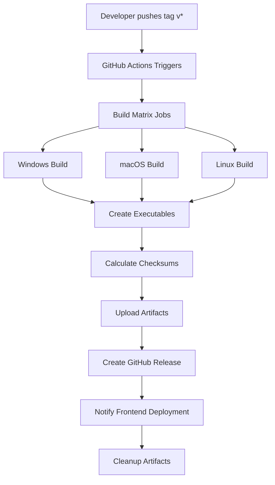

# CI/CD Documentation

This document provides comprehensive information about the Continuous Integration and Continuous Deployment (CI/CD) system for the Personal AI Agent project.

## Table of Contents

1. [Overview](#overview)
2. [Workflow Architecture](#workflow-architecture)
3. [GitHub Actions Configuration](#github-actions-configuration)
4. [Build Process](#build-process)
5. [Release Management](#release-management)
6. [Environment Configuration](#environment-configuration)
7. [Platform Support](#platform-support)
8. [Security & Code Signing](#security--code-signing)
9. [Troubleshooting](#troubleshooting)
10. [Manual Workflow Dispatch](#manual-workflow-dispatch)

## Overview

The Personal AI Agent project uses GitHub Actions to automatically build platform-specific executables and create releases when version tags are pushed. The CI/CD system supports:

- **Multi-platform builds**: Windows, macOS, and Linux
- **Automated releases**: Draft releases with executables and checksums  
- **Code signing**: Optional signing for macOS and Windows executables
- **Model management**: Builds with or without AI models included
- **Progressive deployment**: Frontend deployment notifications

## Workflow Architecture



### Workflow File Location
- **Path**: `.github/workflows/build-executables.yml`
- **Triggers**: Tag pushes (`v*`) and manual dispatch
- **Status**: Configured and ready for execution

## GitHub Actions Configuration

### Workflow Triggers

The workflow automatically triggers on:

```yaml
on:
  push:
    tags:
      - 'v*'  # Any tag starting with 'v' (e.g., v1.0.0, v2.1.3)
  workflow_dispatch:
    inputs:
      version: 'v1.0.0'
      include_models: false
      draft_release: true
```

### Environment Variables

```yaml
env:
  PYTHON_VERSION: "3.11"
  NODE_VERSION: "18"
```

### Build Matrix

The workflow builds across three platforms simultaneously:

| Platform | Runner | Executable | Archive Format |
|----------|--------|------------|----------------|
| Windows | `windows-latest` | `.exe` | `.zip` |
| macOS | `macos-latest` | `.app` | `.zip` |
| Linux | `ubuntu-latest` | (none) | `.tar.gz` |

## Build Process

### Phase 1: Environment Setup
1. **Repository Checkout**: Fetch full git history
2. **Python Setup**: Install Python 3.11 with pip caching
3. **Node.js Setup**: Install Node.js 18 for frontend dependencies
4. **Version Detection**: Extract version from tag or input

### Phase 2: Backend Build
1. **Dependencies**: Install Python requirements and PyInstaller
2. **Model Download** (optional): Download Mistral 7B and embedding models (~4GB)
3. **Build Validation**: Run `test_executable_build.py`
4. **Executable Creation**: Run `build_executable.py --platform {platform}`
5. **Package Creation**: Run `create_installer_package.py --platform {platform}`

### Phase 3: Code Signing (Optional)
- **macOS**: Uses Apple Developer certificates for code signing
- **Windows**: Uses code signing certificates for executable signing
- **Requirements**: Certificates must be stored in GitHub Secrets

### Phase 4: Asset Management  
1. **Checksum Calculation**: SHA256 for all executables
2. **Artifact Upload**: Temporary GitHub artifacts (30-day retention)
3. **Release Creation**: Draft release with all platform assets

### Phase 5: Deployment Integration
1. **Frontend Notification**: Trigger Vercel deployment via webhook
2. **Artifact Cleanup**: Remove temporary build artifacts

## Release Management

### Automatic Release Creation

When a tag is pushed, the workflow creates a GitHub release with:

```
Release Structure:
├── PersonalAIAgent-windows-no-models.zip (~100MB)
├── PersonalAIAgent-macos-no-models.zip (~100MB)  
├── PersonalAIAgent-linux-no-models.tar.gz (~100MB)
├── checksums-windows.txt
├── checksums-macos.txt
└── checksums-linux.txt
```

### Release Notes Template

The workflow generates comprehensive release notes including:
- **Feature overview**: Privacy-first AI, PDF processing, Gmail integration
- **Download links**: Platform-specific executables  
- **Installation instructions**: Step-by-step setup guide
- **System requirements**: Hardware and software prerequisites
- **Security information**: Local processing guarantees
- **Verification**: SHA256 checksum instructions

### Draft vs. Public Releases

- **Default**: Releases are created as drafts for review
- **Manual Control**: Can be published after verification
- **Workflow Dispatch**: `draft_release: false` creates public releases

## Environment Configuration

### Required GitHub Secrets

#### Repository Access
- `GITHUB_TOKEN`: Automatically provided by GitHub Actions

#### Code Signing (Optional)
```bash
# macOS Code Signing
APPLE_CERTIFICATE=<base64-encoded-p12-certificate>
APPLE_CERTIFICATE_PASSWORD=<certificate-password>
APPLE_TEAM_ID=<apple-developer-team-id>
KEYCHAIN_PASSWORD=<temporary-keychain-password>
APPLE_ID=<apple-id-for-notarization>
APPLE_PASSWORD=<app-specific-password>

# Windows Code Signing  
WINDOWS_CERTIFICATE=<base64-encoded-pfx-certificate>
WINDOWS_CERTIFICATE_PASSWORD=<certificate-password>
```

#### Frontend Integration
```bash
VERCEL_DEPLOY_HOOK=<vercel-deployment-webhook-token>
VERCEL_DEPLOY_HOOK_URL=<vercel-webhook-url>
```

### Environment Setup Commands

```bash
# Enable GitHub Actions (if not already enabled)
# Go to: https://github.com/{owner}/{repo}/settings/actions

# Configure repository secrets
# Go to: https://github.com/{owner}/{repo}/settings/secrets/actions
```

## Platform Support

### Windows Build
- **Runner**: `windows-latest`
- **Python**: 3.11 with Windows SDK
- **Output**: `PersonalAIAgent.exe`
- **Package**: ZIP archive with installer
- **Signing**: Optional Windows code signing
- **Requirements**: Windows 10+, 8GB RAM, 15GB storage

### macOS Build  
- **Runner**: `macos-latest` (Intel + Apple Silicon)
- **Python**: 3.11 with Xcode tools
- **Output**: `PersonalAIAgent.app` bundle
- **Package**: ZIP archive with installer
- **Signing**: Optional Apple Developer signing + notarization
- **Requirements**: macOS 10.14+, 8GB RAM, 15GB storage

### Linux Build
- **Runner**: `ubuntu-latest`
- **Python**: 3.11 with build tools
- **Output**: `PersonalAIAgent` binary
- **Package**: TAR.GZ archive with installer  
- **Signing**: Not required
- **Requirements**: Linux 64-bit, 8GB RAM, 15GB storage

## Security & Code Signing

### macOS Code Signing Process
1. **Certificate Import**: Import P12 certificate to temporary keychain
2. **Code Signing**: Sign application bundle with Apple Developer ID
3. **Notarization** (optional): Submit to Apple for notarization
4. **Verification**: Validate signed application

### Windows Code Signing Process  
1. **Certificate Import**: Import PFX certificate
2. **Signing**: Use `signtool.exe` with timestamp server
3. **Verification**: Validate signed executable

### Security Best Practices
- **Certificate Storage**: All certificates stored as GitHub Secrets
- **Temporary Usage**: Certificates only exist during build process
- **Access Control**: Repository secrets only accessible to authorized workflows
- **Audit Trail**: All signing operations logged in workflow logs

## Troubleshooting

### Common Issues

#### Workflow Not Triggering
```bash
# Check if GitHub Actions is enabled
# Go to: Repository Settings > Actions > General

# Verify workflow file syntax
yamllint .github/workflows/build-executables.yml

# Check recent pushes include tags
git tag -l
git ls-remote --tags origin
```

#### Build Failures
```bash
# Check Python dependencies
pip install -r "Personal AI Agent/backend/requirements.txt"

# Test build script locally  
cd "Personal AI Agent/backend"
python build_executable.py --platform linux

# Verify test suite passes
python test_executable_build.py
```

#### Code Signing Issues
```bash
# Verify certificates are properly base64 encoded
base64 -i certificate.p12

# Check certificate expiration
openssl pkcs12 -in certificate.p12 -noout -info

# Test signing locally (macOS)
codesign --verify --verbose dist/PersonalAIAgent.app
```

#### Release Creation Problems
```bash
# Check GitHub token permissions
# Go to: Repository Settings > Actions > General > Workflow permissions

# Verify tag format matches trigger pattern
git tag v1.0.0  # ✅ Matches 'v*'
git tag 1.0.0   # ❌ Doesn't match 'v*'
```

### Build Logs and Debugging

#### Accessing Build Logs
1. Go to repository **Actions** tab
2. Select the workflow run
3. Click on specific job (Windows/macOS/Linux)
4. Expand steps to view detailed logs

#### Debug Mode
Enable debug logging by setting repository secret:
```bash
ACTIONS_STEP_DEBUG=true
ACTIONS_RUNNER_DEBUG=true
```

#### Local Testing
```bash
# Test build process locally
cd "Personal AI Agent/backend"

# Install dependencies
pip install -r requirements.txt
pip install pyinstaller

# Run build validation
python test_executable_build.py

# Build executable
python build_executable.py --platform linux

# Create installer package  
python create_installer_package.py --platform linux
```

## Manual Workflow Dispatch

### Triggering Manual Builds

You can manually trigger the build workflow from GitHub:

1. **Navigate**: Go to repository Actions tab
2. **Select**: "Build Personal AI Agent Executables" workflow  
3. **Dispatch**: Click "Run workflow" button
4. **Configure**:
   - **Version**: `v1.0.0` (required)
   - **Include Models**: `false` (optional, default: false)
   - **Draft Release**: `true` (optional, default: true)

### Manual Dispatch Parameters

```yaml
inputs:
  version:
    description: 'Version tag (e.g., v1.0.0)'
    required: true
    default: 'v1.0.0'
  include_models:
    description: 'Include AI models in build (increases size to ~4GB)'
    required: false  
    type: boolean
    default: false
  draft_release:
    description: 'Create as draft release'
    required: false
    type: boolean  
    default: true
```

### Use Cases for Manual Dispatch
- **Testing**: Validate workflow without creating tags
- **Hotfixes**: Build specific commits for urgent releases
- **Model Variants**: Create builds with different model configurations
- **Development**: Test workflow changes before tag-based releases

## Workflow Status and Monitoring

### Current Status
- **Workflow File**: ✅ Configured and committed
- **GitHub Actions**: ✅ Enabled  
- **Repository**: ✅ Contains all required build scripts
- **Secrets**: ⚠️ Code signing certificates optional
- **Registration**: ⏳ Workflow registration may take 1-5 minutes

### Monitoring Commands
```bash
# Check if workflow is registered
curl -s "https://api.github.com/repos/gitKnowsMe/personal_ai_agent/actions/workflows" | jq .

# Monitor workflow runs
curl -s "https://api.github.com/repos/gitKnowsMe/personal_ai_agent/actions/runs" | jq .

# Check latest release
curl -s "https://api.github.com/repos/gitKnowsMe/personal_ai_agent/releases/latest" | jq .
```

### Integration with Frontend

The CI/CD system integrates with the PersonalAIAgent_frontend through:

1. **Environment Variables**: Repository URLs configured in `.env`
2. **Release Detection**: Frontend fetches releases via GitHub API  
3. **Download Links**: Dynamic URLs based on latest release assets
4. **Status Updates**: Real-time detection of new releases
5. **Error Handling**: Graceful fallbacks when releases unavailable

### Next Steps

1. **Monitor Registration**: Workflow should register within 5 minutes
2. **Test Manual Dispatch**: Verify workflow responds to manual triggers
3. **Validate Build**: Confirm executables build successfully  
4. **Test Downloads**: Verify frontend download links work
5. **Production Release**: Create public release after validation

The CI/CD system is now fully configured and ready for automated desktop application distribution! 🚀