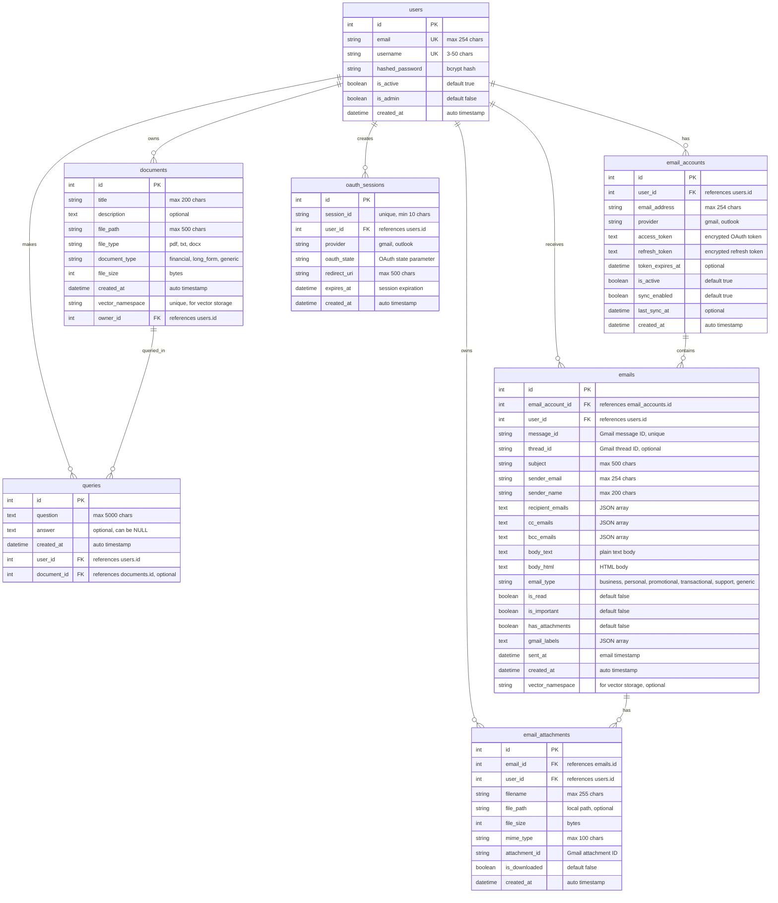
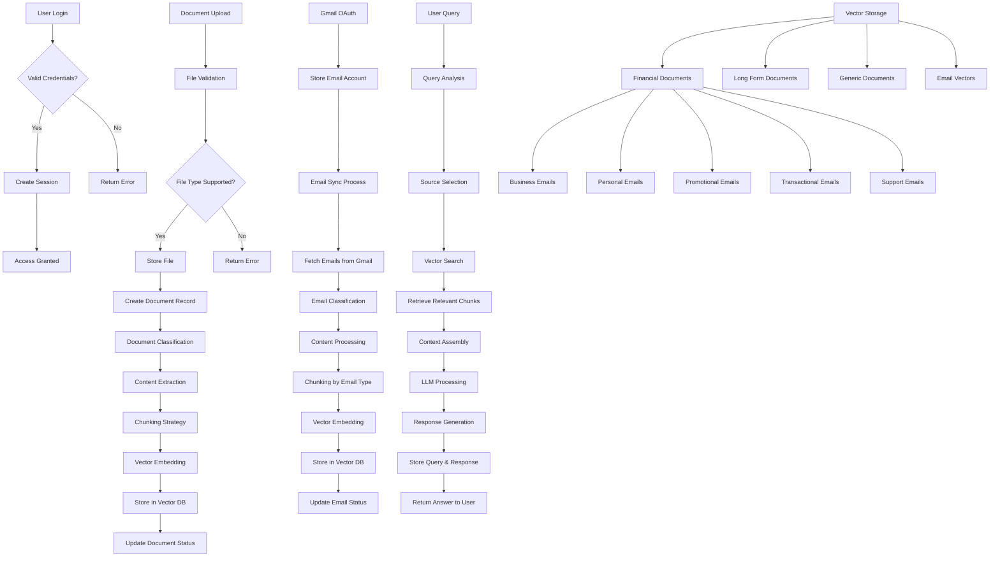
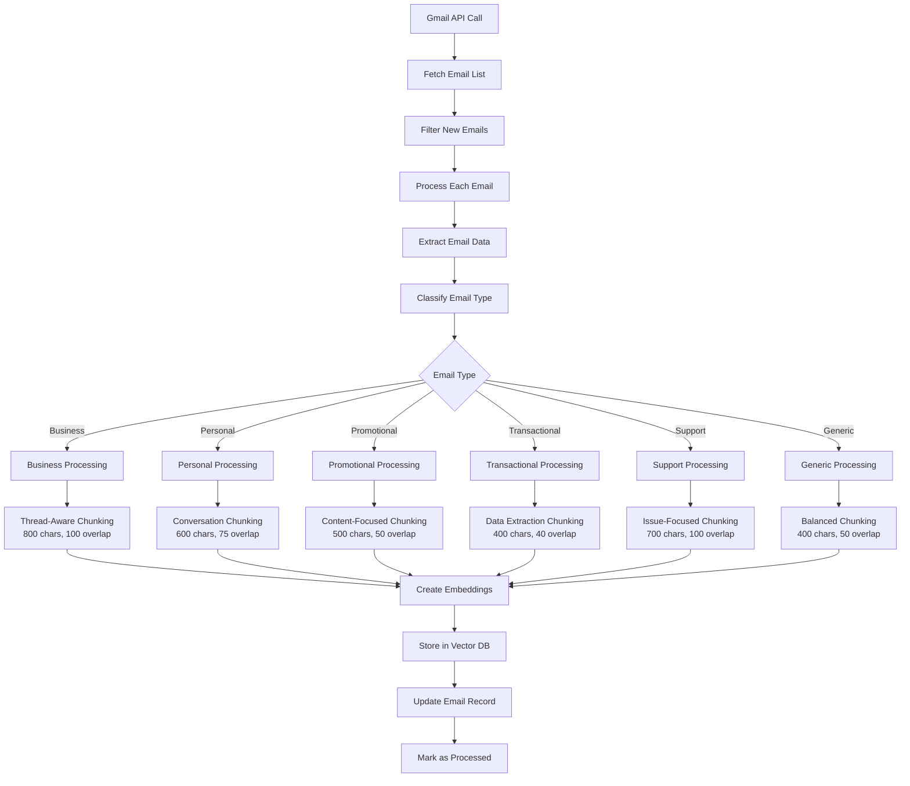
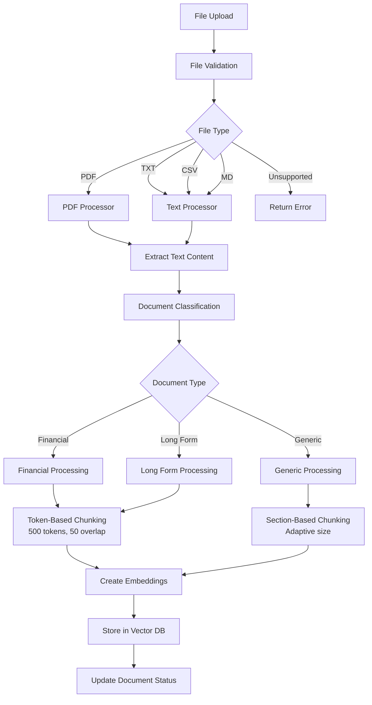
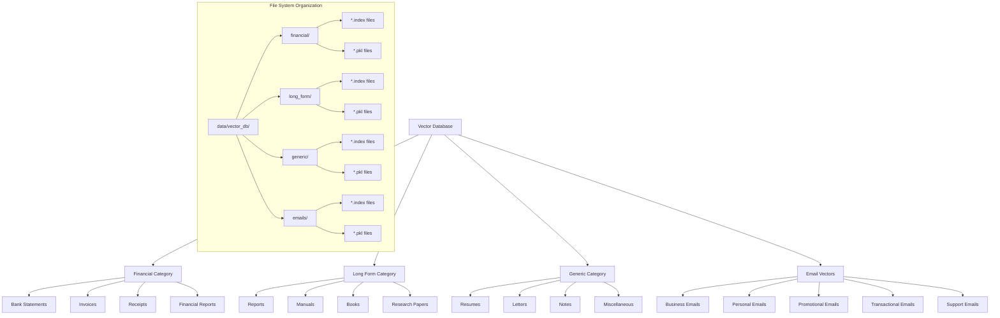
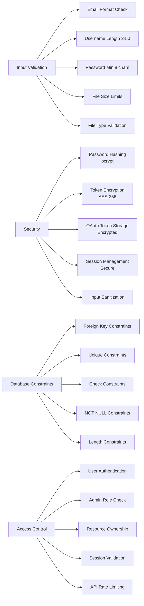

# Personal AI Agent - Complete Database Schema & Workflow Diagram

## Database Schema Overview

This document provides a comprehensive view of the Personal AI Agent database structure, including all tables, relationships, data flow, and processing workflows.

## Entity Relationship Diagram

## Data Flow & Processing Workflow

## Database Indexes & Performance

```mermaid
graph LR
    %% Primary Indexes
    A[Primary Keys] --> A1[users.id]
    A --> A2[documents.id]
    A --> A3[queries.id]
    A --> A4[email_accounts.id]
    A --> A5[emails.id]
    A --> A6[email_attachments.id]
    A --> A7[oauth_sessions.id]
    
    %% Foreign Key Indexes
    B[Foreign Key Indexes] --> B1[idx_documents_owner_id]
    B --> B2[idx_queries_user_id]
    B --> B3[idx_queries_document_id]
    B --> B4[idx_email_accounts_user_id]
    B --> B5[idx_emails_user_id]
    B --> B6[idx_emails_email_account_id]
    B --> B7[idx_email_attachments_email_id]
    B --> B8[idx_email_attachments_user_id]
    B --> B9[idx_oauth_sessions_user_id]
    
    %% Performance Indexes
    C[Performance Indexes] --> C1[idx_documents_document_type]
    C --> C2[idx_documents_created_at]
    C --> C3[idx_queries_created_at]
    C --> C4[idx_email_accounts_is_active]
    C --> C5[idx_email_accounts_sync_enabled]
    C --> C6[idx_email_accounts_last_sync_at]
    C --> C7[idx_emails_email_type]
    C --> C8[idx_emails_is_read]
    C --> C9[idx_emails_has_attachments]
    C --> C10[idx_emails_is_important]
    C --> C11[idx_emails_sent_at]
    C --> C12[idx_email_attachments_is_downloaded]
    C --> C13[idx_email_attachments_mime_type]
    C --> C14[idx_oauth_sessions_expires_at]
    C --> C15[idx_oauth_sessions_provider]
    
    %% Composite Indexes
    D[Composite Indexes] --> D1[idx_emails_user_account_composite]
    D --> D2[idx_emails_user_type_composite]
    D --> D3[idx_emails_user_sent_at_composite]
    D --> D4[idx_emails_account_sent_at_composite]
    D --> D5[idx_emails_user_read_composite]
    
    %% Unique Indexes
    E[Unique Indexes] --> E1[users.email]
    E --> E2[users.username]
    E --> E3[documents.vector_namespace]
    E --> E4[emails.message_id]
    E --> E5[oauth_sessions.session_id]
```

## Email Processing Workflow

## Document Processing Workflow

## Vector Storage Architecture

## Security & Constraints

## Key Features & Capabilities

### 1. Multi-User Support
- Isolated user data with proper foreign key relationships
- Admin user management capabilities
- Secure session management

### 2. Document Processing
- Support for PDF, TXT, CSV, MD files
- Automatic document classification (financial, long_form, generic)
- Adaptive chunking strategies based on document type
- Vector storage with FAISS for similarity search

### 3. Email Integration
- Gmail OAuth integration
- Email classification (business, personal, promotional, transactional, support)
- Type-specific chunking strategies
- Attachment handling
- Thread-aware processing

### 4. Vector Search & RAG
- FAISS-based vector similarity search
- Category-organized vector storage
- Multi-source query processing
- Context-aware response generation

### 5. Performance Optimization
- Comprehensive indexing strategy
- Composite indexes for common query patterns
- Efficient vector storage organization
- Connection pooling and timeout handling

### 6. Security & Data Integrity
- Encrypted token storage
- Input validation and sanitization
- Database constraints and checks
- Secure authentication flow

This database schema supports a comprehensive personal AI assistant that can process documents, integrate with email systems, and provide intelligent responses through vector-based retrieval and LLM processing. 