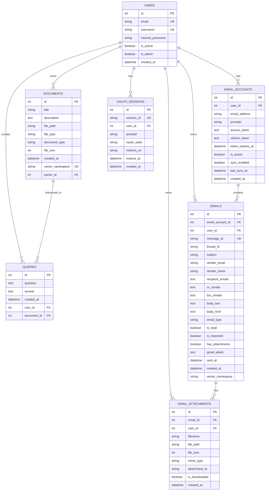
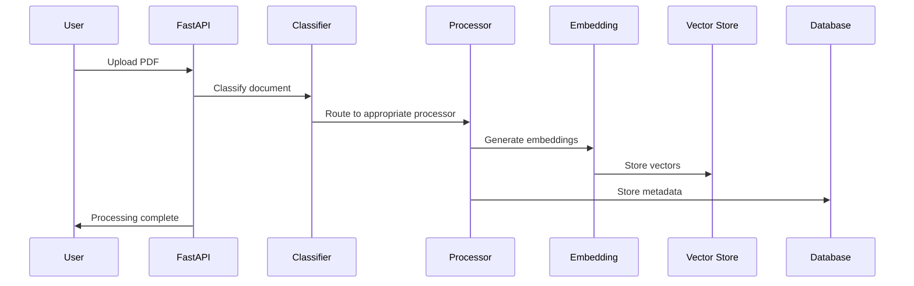
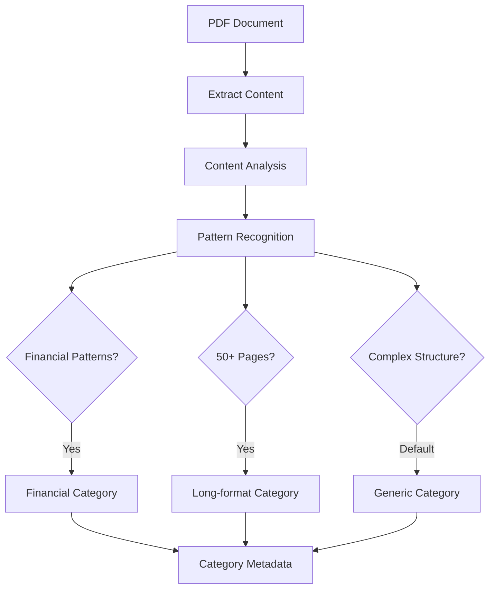
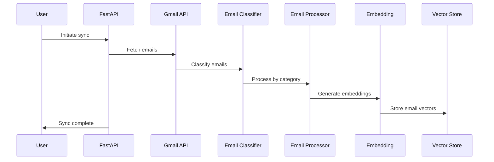
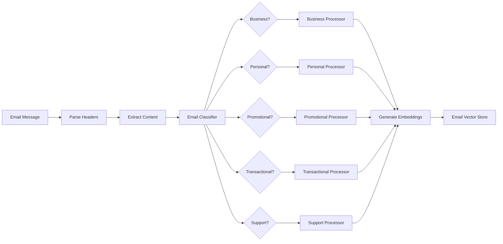
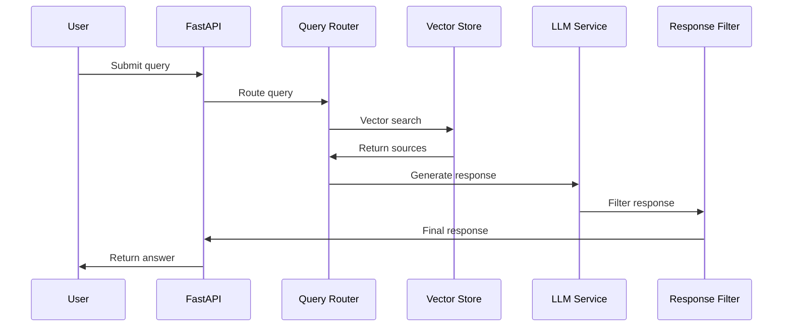
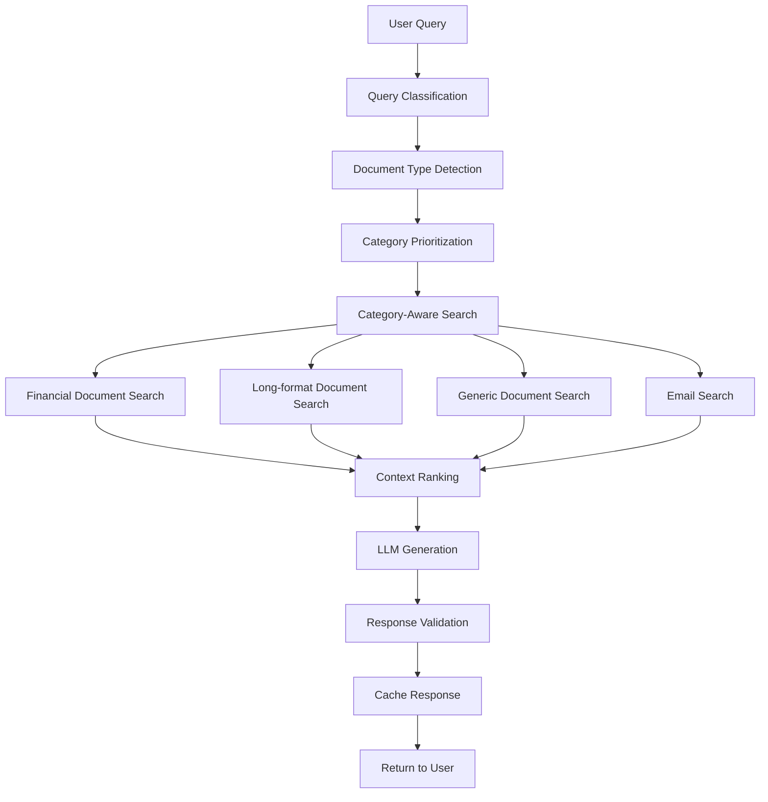
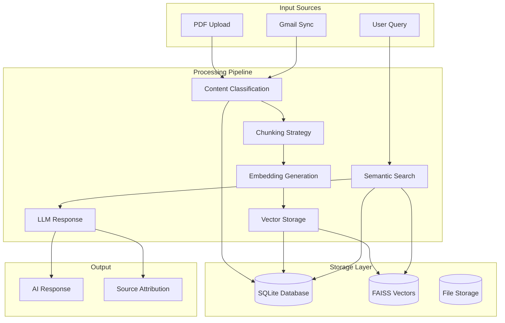
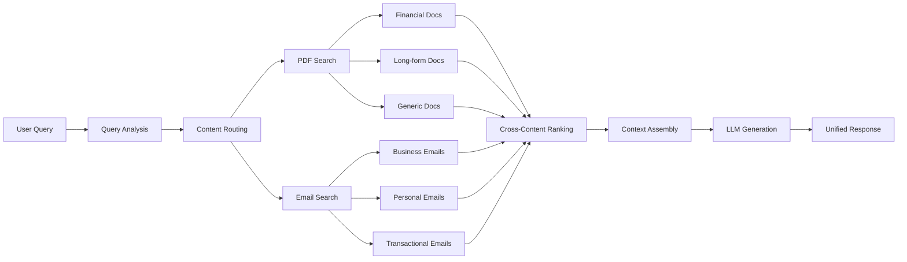

# Personal AI Agent - Database & Workflow Documentation

## Table of Contents
1. [Database Schema Overview](#database-schema-overview)
2. [System Workflow Architecture](#system-workflow-architecture)
3. [Document Processing Workflow](#document-processing-workflow)
4. [Email Processing Workflow](#email-processing-workflow)
5. [Query Processing Workflow](#query-processing-workflow)
6. [File Storage Structure](#file-storage-structure)
7. [Classification Systems](#classification-systems)
8. [Key Configuration](#key-configuration)
9. [Current System Status](#current-system-status)
10. [Database Models](#database-models)
11. [Performance Indexes](#performance-indexes)
12. [Data Flow Diagrams](#data-flow-diagrams)

---

## Database Schema Overview

### Entity Relationship Diagram



---

## System Workflow Architecture

### High-Level Architecture Diagram

```mermaid
graph TB
    subgraph "Frontend Layer"
        UI[Web Interface]
        API_CLIENT[API Client]
    end
    
    subgraph "API Layer"
        FASTAPI[FastAPI Application]
        AUTH[Authentication Service]
        MIDDLEWARE[Logging Middleware]
    end
    
    subgraph "Business Logic Layer"
        QUERY_ROUTER[Query Router]
        DOC_PROCESSOR[Document Processor]
        DOC_CLASSIFIER[Document Classifier]
        EMAIL_PROCESSOR[Email Processor]
        EMAIL_CLASSIFIER[Email Classifier]
        VECTOR_SERVICE[Vector Store Service]
        GMAIL_SERVICE[Gmail Service]
    end
    
    subgraph "AI Processing Layer"
        LLM[Local LLM (Mistral 7B)]
        EMBEDDINGS[MiniLM Embeddings]
        PDF_PROCESSOR[PDF Content Extractor]
    end
    
    subgraph "Data Layer"
        POSTGRES[(SQLite Database)]
        FAISS[(FAISS Vector DB)]
        PDF_FILES[(PDF File Storage)]
        EMAIL_STORAGE[(Email Storage)]
    end
    
    subgraph "External Integration"
        GMAIL_API[Gmail API]
        OAUTH2[OAuth2 Authentication]
    end
    
    UI --> FASTAPI
    API_CLIENT --> FASTAPI
    FASTAPI --> AUTH
    FASTAPI --> MIDDLEWARE
    FASTAPI --> QUERY_ROUTER
    FASTAPI --> DOC_PROCESSOR
    FASTAPI --> GMAIL_SERVICE
    DOC_PROCESSOR --> DOC_CLASSIFIER
    GMAIL_SERVICE --> EMAIL_PROCESSOR
    EMAIL_PROCESSOR --> EMAIL_CLASSIFIER
    QUERY_ROUTER --> VECTOR_SERVICE
    DOC_PROCESSOR --> PDF_PROCESSOR
    VECTOR_SERVICE --> LLM
    VECTOR_SERVICE --> EMBEDDINGS
    VECTOR_SERVICE --> FAISS
    AUTH --> POSTGRES
    DOC_PROCESSOR --> PDF_FILES
    EMAIL_PROCESSOR --> EMAIL_STORAGE
    GMAIL_SERVICE --> GMAIL_API
    GMAIL_SERVICE --> OAUTH2
    QUERY_ROUTER --> POSTGRES
```

---

## Document Processing Workflow

### PDF Upload and Processing Sequence



### Document Classification Flow



---

## Email Processing Workflow

### Gmail Sync and Processing Sequence



### Email Classification System



---

## Query Processing Workflow

### Query Routing and Response Generation



### Query Processing Flow



---

## File Storage Structure

### Directory Organization

```
backend/data/
├── app.db                    # SQLite database (44KB)
├── vector_db/               # FAISS vector indices
│   ├── financial/           # Financial document vectors
│   │   ├── user_1_doc_bank_statement.index
│   │   └── user_1_doc_bank_statement.pkl
│   ├── long_form/           # Long-form document vectors
│   │   ├── user_1_doc_research_paper.index
│   │   └── user_1_doc_research_paper.pkl
│   ├── generic/             # Generic document vectors
│   │   ├── user_1_doc_resume.index
│   │   └── user_1_doc_resume.pkl
│   └── emails/              # Email vectors
│       ├── user_1_email_gmail_123.index
│       └── user_1_email_gmail_123.pkl
├── email_vectors/           # Email-specific vectors
├── emails/                  # Email storage
└── uploads/                 # Uploaded PDF files
    ├── 1/                   # User ID
    │   ├── financial/
    │   ├── long_form/
    │   └── generic/
    └── 2/
```

### Vector Storage Organization

| Category | Namespace Pattern | Chunk Size | Overlap | Processing Strategy |
|----------|------------------|------------|---------|-------------------|
| **Financial** | `user_{id}_doc_{filename}` | 500 chars | 50 chars | Structured parsing, exact matching |
| **Long-format** | `user_{id}_doc_{filename}` | 1500 chars | 300 chars | Deep semantic analysis |
| **Generic** | `user_{id}_doc_{filename}` | 1000 chars | 200 chars | Balanced approach |
| **Emails** | `user_{id}_email_{source}_{id}` | Variable | Variable | Thread-aware processing |

---

## Classification Systems

### Document Classification System

| Category | Detection Criteria | Chunk Size | Processing Strategy | Use Cases |
|----------|-------------------|------------|-------------------|-----------|
| **Financial** | Transaction patterns, dollar amounts, bank terminology, statement keywords | 500 chars | Structured parsing, exact matching | Bank statements, invoices, receipts |
| **Long-format** | 50+ pages, academic structure, research patterns, complex formatting | 1500 chars | Deep semantic analysis | Research papers, reports, contracts |
| **Generic** | Personal documents, resumes, letters, moderate length content | 1000 chars | Balanced approach | Resumes, cover letters, personal docs |

### Email Classification System

| Category | Characteristics | Processing Strategy | Use Cases |
|----------|----------------|-------------------|-----------|
| **Business** | Meeting invites, project updates, work communications | Thread-aware context, semantic search | Work emails, project tracking |
| **Personal** | Family/friend emails, personal communications | Conversation preservation, relationship context | Personal correspondence |
| **Promotional** | Marketing emails, newsletters, deals | Content-focused chunks, temporal relevance | Marketing analysis, deal tracking |
| **Transactional** | Receipts, confirmations, account notifications | Structured chunks, data extraction | Purchase tracking, account monitoring |
| **Support** | Customer service, technical support | Issue-focused chunks, solution tracking | Support history, technical issues |

---

## Key Configuration

### Database Configuration

```python
# Database Settings
DATABASE_URL = "sqlite:///./personal_ai_agent.db"
DATABASE_TIMEOUT = 30
DATABASE_POOL_PRE_PING = True

# File Storage
STATIC_DIR = "backend/static"
UPLOAD_DIR = "backend/data/uploads"
MAX_FILE_SIZE = 10MB
SUPPORTED_EXTENSIONS = ['.pdf', '.txt', '.docx']

# Vector Database
VECTOR_DB_PATH = "backend/data/vector_db"
VECTOR_SEARCH_TOP_K = 5
VECTOR_SIMILARITY_THRESHOLD = 0.7
```

### AI Model Configuration

```python
# LLM Settings
LLM_MODEL_PATH = "./models/mistral-7b-instruct-v0.1.Q4_K_M.gguf"
LLM_CONTEXT_WINDOW = 4096
LLM_THREADS = 4
LLM_TEMPERATURE = 0.7
LLM_TOP_P = 0.9
LLM_TOP_K = 40
LLM_MAX_TOKENS = 2048

# Metal Acceleration (macOS)
USE_METAL = True
METAL_N_GPU_LAYERS = 1

# Embedding Model
EMBEDDING_MODEL = "sentence-transformers/all-MiniLM-L6-v2"
EMBEDDING_BATCH_SIZE = 32
```

### Gmail Integration Configuration

```python
# Gmail OAuth Settings
GMAIL_CLIENT_ID = "your-client-id.apps.googleusercontent.com"
GMAIL_CLIENT_SECRET = "GOCSPX-your-secret"
GMAIL_REDIRECT_URI = "http://localhost:8000/api/gmail/callback"

# Email Processing
GMAIL_MAX_EMAILS_PER_SYNC = 1000
GMAIL_DEFAULT_SYNC_LIMIT = 100
EMAIL_STORAGE_DIR = "backend/data/emails"
EMAIL_VECTOR_DB_PATH = "backend/data/email_vectors"
```

---

## Current System Status

### Database Statistics
- **Database File**: `backend/data/app.db`
- **Size**: 44KB (indicates active usage)
- **Type**: SQLite with comprehensive indexing
- **Status**: Active with user data and processing history

### System Components Status

| Component | Status | Details |
|-----------|--------|---------|
| **Database** | ✅ Active | SQLite with 44KB of data |
| **Vector Storage** | ✅ Active | FAISS indices organized by category |
| **Document Processing** | ✅ Active | PDF classification and processing |
| **Email Integration** | ✅ Active | Gmail OAuth and email processing |
| **AI Models** | ✅ Active | Local Mistral 7B + MiniLM embeddings |
| **Query System** | ✅ Active | Intelligent routing and response generation |

### Hybrid Deployment Architecture

The system is designed for **hybrid deployment**:

```
┌─────────────────┐    HTTPS    ┌─────────────────┐
│   Vercel v0     │────────────▶│   Local User    │
│   Frontend      │             │   Machine       │
│ (Public Access) │             │                 │
└─────────────────┘             │ ┌─────────────┐ │
                                │ │   Backend   │ │
                                │ │  (Private)  │ │
                                │ └─────────────┘ │
                                │ ┌─────────────┐ │
                                │ │ Vector DB   │ │
                                │ │  (Local)    │ │
                                │ └─────────────┘ │
                                │ ┌─────────────┐ │
                                │ │ LLM Models  │ │
                                │ │  (Local)    │ │
                                │ └─────────────┘ │
                                └─────────────────┘
```

**Benefits:**
- **🔒 Privacy First**: All AI processing and data storage remains local
- **🌍 Global Access**: Frontend deployed on Vercel CDN for fast worldwide access
- **💰 Cost Effective**: No cloud AI API costs (GPT-4, Claude, etc.)
- **🚀 Easy Setup**: Automated local backend installation
- **🔧 Flexible**: Users can run backend anywhere (localhost, home server, cloud)

---

## Database Models

### User Model
```python
class User(Base):
    __tablename__ = "users"
    
    id = Column(Integer, primary_key=True, index=True)
    email = Column(String(EMAIL_MAX_LENGTH), unique=True, index=True, nullable=False)
    username = Column(String(USERNAME_MAX_LENGTH), unique=True, index=True, nullable=False)
    hashed_password = Column(String(255), nullable=False)
    is_active = Column(Boolean, default=True, nullable=False)
    is_admin = Column(Boolean, default=False, nullable=False)
    created_at = Column(DateTime(timezone=True), server_default=func.now(), nullable=False)
    
    # Relationships
    documents = relationship("Document", back_populates="owner")
    queries = relationship("Query", back_populates="user")
    email_accounts = relationship("EmailAccount", back_populates="user")
    emails = relationship("Email", back_populates="user")
    email_attachments = relationship("EmailAttachment", back_populates="user")
```

### Document Model
```python
class Document(Base):
    __tablename__ = "documents"
    
    id = Column(Integer, primary_key=True, index=True)
    title = Column(String(TITLE_MAX_LENGTH), index=True, nullable=False)
    description = Column(Text, nullable=True)
    file_path = Column(String(500), nullable=False)
    file_type = Column(String(10), nullable=False)
    document_type = Column(String(20), nullable=False, default="generic")
    file_size = Column(Integer, nullable=False)
    created_at = Column(DateTime(timezone=True), server_default=func.now(), nullable=False)
    vector_namespace = Column(String(200), unique=True, nullable=False)
    owner_id = Column(Integer, ForeignKey("users.id"), nullable=False)
    
    # Relationships
    owner = relationship("User", back_populates="documents")
    queries = relationship("Query", back_populates="document")
```

### Email Model
```python
class Email(Base):
    __tablename__ = "emails"
    
    id = Column(Integer, primary_key=True, index=True)
    email_account_id = Column(Integer, ForeignKey("email_accounts.id"), nullable=False)
    user_id = Column(Integer, ForeignKey("users.id"), nullable=False)
    message_id = Column(String(255), nullable=False, unique=True, index=True)
    thread_id = Column(String(255), nullable=True, index=True)
    subject = Column(String(500), nullable=True)
    sender_email = Column(String(EMAIL_MAX_LENGTH), nullable=False, index=True)
    sender_name = Column(String(200), nullable=True)
    recipient_emails = Column(Text, nullable=True)
    cc_emails = Column(Text, nullable=True)
    bcc_emails = Column(Text, nullable=True)
    body_text = Column(Text, nullable=True)
    body_html = Column(Text, nullable=True)
    email_type = Column(String(20), nullable=False, default="generic")
    is_read = Column(Boolean, default=False, nullable=False)
    is_important = Column(Boolean, default=False, nullable=False)
    has_attachments = Column(Boolean, default=False, nullable=False)
    gmail_labels = Column(Text, nullable=True)
    sent_at = Column(DateTime(timezone=True), nullable=False, index=True)
    created_at = Column(DateTime(timezone=True), server_default=func.now(), nullable=False)
    vector_namespace = Column(String(200), nullable=True)
    
    # Relationships
    email_account = relationship("EmailAccount", back_populates="emails")
    user = relationship("User", back_populates="emails")
    attachments = relationship("EmailAttachment", back_populates="email")
```

---

## Performance Indexes

### Database Indexes

#### Users Table
- `id` (Primary Key)
- `email` (Unique, Index)
- `username` (Unique, Index)

#### Documents Table
- `id` (Primary Key)
- `owner_id` (Index) - Performance for user document queries
- `document_type` (Index) - Performance for category filtering
- `created_at` (Index) - Performance for chronological queries
- `title` (Index) - Performance for title searches

#### Queries Table
- `id` (Primary Key)
- `user_id` (Index) - Performance for user query history
- `document_id` (Index) - Performance for document-specific queries
- `created_at` (Index) - Performance for chronological queries

#### Emails Table
- `id` (Primary Key)
- `user_id` (Index) - High priority foreign key
- `email_account_id` (Index) - High priority foreign key
- `email_type` (Index) - Medium priority filtering
- `is_read` (Index) - Medium priority filtering
- `has_attachments` (Index) - Medium priority filtering
- `is_important` (Index) - Medium priority filtering
- `sent_at` (Index) - Performance for chronological queries
- `message_id` (Unique, Index) - Gmail message ID
- `thread_id` (Index) - Gmail thread ID
- `sender_email` (Index) - Performance for sender queries

#### Composite Indexes
- `idx_emails_user_account_composite` (user_id, email_account_id)
- `idx_emails_user_type_composite` (user_id, email_type)
- `idx_emails_user_sent_at_composite` (user_id, sent_at)
- `idx_emails_account_sent_at_composite` (email_account_id, sent_at)
- `idx_emails_user_read_composite` (user_id, is_read)

### Vector Database Performance

#### FAISS Index Configuration
- **Index Type**: IVF (Inverted File Index)
- **Vector Dimension**: 384 (MiniLM-L6-v2)
- **Search Strategy**: Approximate Nearest Neighbor (ANN)
- **Performance**: Sub-second search times for large datasets

#### Category-Specific Optimization
- **Financial**: Small chunks (500 chars) for precise transaction matching
- **Long-format**: Large chunks (1500 chars) for comprehensive context
- **Generic**: Balanced chunks (1000 chars) for general queries
- **Emails**: Thread-aware chunking for conversation context

---

## Data Flow Diagrams

### Complete System Data Flow



### Cross-Content Query Flow



---

## Summary

The Personal AI Agent database and workflow system provides:

1. **Comprehensive Data Model**: 7 main tables with proper relationships and constraints
2. **Intelligent Classification**: Automatic categorization of documents and emails
3. **Optimized Performance**: Strategic indexing and vector database organization
4. **Hybrid Architecture**: Privacy-first local processing with global frontend access
5. **Scalable Design**: Modular components for easy maintenance and extension

The system successfully balances **privacy** (local processing), **performance** (optimized indexes), and **usability** (intelligent classification) to provide a powerful AI assistant for personal document and email management. 